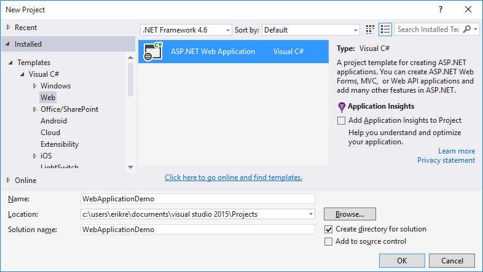
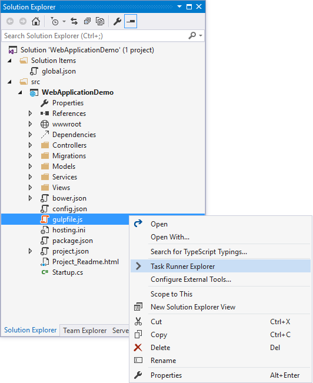
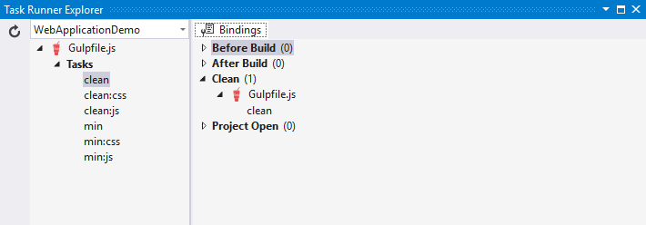
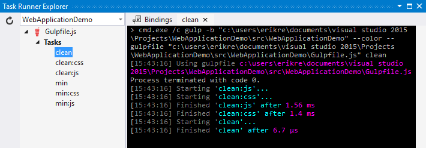
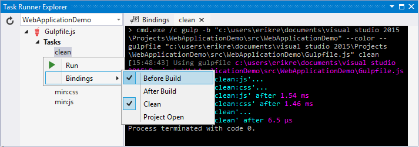
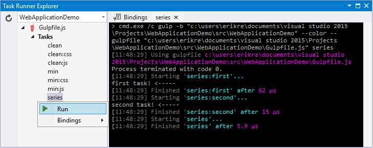
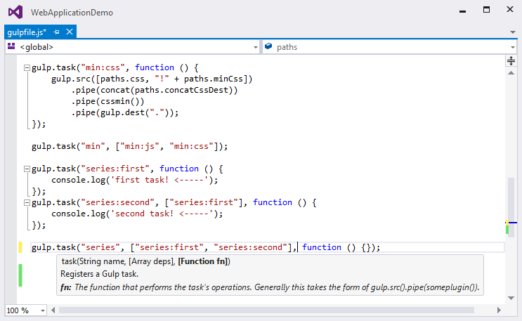

---
uid: client-side/using-gulp
---
<a name=using-gulp></a>

  # Using Gulp

By [Erik Reitan](https://github.com/Erikre), [Scott Addie](https://scottaddie.com) and [Daniel Roth](https://github.com/danroth27)

In a typical modern web application, the build process might:

* Bundle and minify JavaScript and CSS files.

* Run tools to call the bundling and minification tasks before each build.

* Compile LESS or SASS files to CSS.

* Compile CoffeeScript or TypeScript files to JavaScript.

A *task runner* is a tool which automates these routine development tasks and more. Visual Studio provides built-in support for two popular JavaScript-based task runners: [Gulp](http://gulpjs.com) and [Grunt](http://gruntjs.com/).

  ## Introducing Gulp

Gulp is a JavaScript-based streaming build toolkit for client-side code. It is commonly used to stream client-side files through a series of processes when a specific event is triggered in a build environment. Some advantages of using Gulp include the automation of common development tasks, the simplification of repetitive tasks, and a decrease in overall development time. For instance, Gulp can be used to automate [bundling and minification](bundling-and-minification.md) or the cleansing of a development environment before a new build.

The ASP.NET Core Web Application project template is used to help you get started designing and coding a new Web application in Visual Studio. It contains default functionality to demonstrate many aspects of ASP.NET. The template also includes Node Package Manager ([npm](https://www.npmjs.com/)) and Gulp, making it easier to add bundling and minification to a project.

> [!NOTE]
> You don't need the ASP.NET Core Web Application project template or Visual Studio to implement bundling and minification. For example, create an ASP.NET project using Yeoman, push it to GitHub, clone it on a Mac, and then bundle and minify the project.

When you create a new web project using ASP.NET Core Web Application template, Visual Studio includes the [Gulp.js npm package](https://www.npmjs.com/package/gulp), the *gulpfile.js* file, and a set of Gulp dependencies. The npm package contains all the prerequisites for running Gulp tasks in your Visual Studio project. The provided *gulpfile.js* file defines a set of Gulp tasks which can be run from the **Task Runner Explorer** window in Visual Studio. The `devDependencies` section of the *package.json* file specifies the development-time dependencies to install. These dependencies are not deployed with the application. You can add new packages to `devDependencies` and save the file:

<!-- literal_block {"backrefs": [], "ids": [], "dupnames": [], "linenos": false, "names": [], "classes": [], "xml:space": "preserve", "language": "json", "highlight_args": {}} -->

````json

   {
     "name": "ASP.NET",
     "version": "0.0.0",
     "devDependencies": {
     "gulp": "3.8.11",
     "gulp-concat": "2.5.2",
     "gulp-cssmin": "0.1.7",
     "gulp-uglify": "1.2.0",
     "rimraf": "2.2.8"
     }
   }
   ````

After adding a new key-value pair in `devDependencies` and saving the file, Visual Studio will download and install the corresponding version of the package. In **Solution Explorer**, these packages are found in **Dependencies** > **npm**.

  ## Gulp Starter Tasks in Visual Studio

A starter set of Gulp tasks is defined in *gulpfile.js*. These tasks delete and minify the CSS and JavaScript files. The following JavaScript, from the first half of *gulpfile.js*, includes Gulp modules and specifies file paths to be referenced within the forthcoming tasks:

<!-- literal_block {"backrefs": [], "ids": [], "dupnames": [], "linenos": false, "names": [], "classes": [], "xml:space": "preserve", "language": "javascript", "highlight_args": {}} -->

````javascript

   /// <binding Clean='clean' />
   "use strict";

   var gulp = require("gulp"),
     rimraf = require("rimraf"),
     concat = require("gulp-concat"),
     cssmin = require("gulp-cssmin"),
     uglify = require("gulp-uglify");

   var paths = {
     webroot: "./wwwroot/"
   };

   paths.js = paths.webroot + "js/**/*.js";
   paths.minJs = paths.webroot + "js/**/*.min.js";
   paths.css = paths.webroot + "css/**/*.css";
   paths.minCss = paths.webroot + "css/**/*.min.css";
   paths.concatJsDest = paths.webroot + "js/site.min.js";
   paths.concatCssDest = paths.webroot + "css/site.min.css";
   ````

The above code specifies which Node modules are required. The `require` function imports each module so that the dependent tasks can utilize their features. Each of the imported modules is assigned to a variable. The modules can be located either by name or path. In this example, the modules named `gulp`, `rimraf`, `gulp-concat`, `gulp-cssmin`, and `gulp-uglify` are retrieved by name. Additionally, a series of paths are created so that the locations of CSS and JavaScript files can be reused and referenced within the tasks. The following table provides descriptions of the modules included in *gulpfile.js*.

<!--     Module Name  Description  gulp  The Gulp streaming build system. For more information, see gulp.  rimraf  A Node deletion module. For more information, see rimraf.  gulp-concat  A module that will concatenate files based on the operating system's newline character. For more information, see gulp-concat.  gulp-cssmin  A module that will minify CSS files. For more information, see gulp-cssmin.  gulp-uglify  A module that minifies .js files using the UglifyJS toolkit. For more information, see gulp-uglify. -->

Once the requisite modules are imported in *gulpfile.js*, the tasks can be specified. Visual Studio registers six tasks, represented by the following code in *gulpfile.js*:

<!-- literal_block {"backrefs": [], "ids": [], "dupnames": [], "linenos": false, "names": [], "classes": [], "xml:space": "preserve", "language": "javascript", "highlight_args": {"hl_lines": [1, 5, 9, 11, 18, 25]}} -->

````javascript

   gulp.task("clean:js", function (cb) {
     rimraf(paths.concatJsDest, cb);
   });

   gulp.task("clean:css", function (cb) {
     rimraf(paths.concatCssDest, cb);
   });

   gulp.task("clean", ["clean:js", "clean:css"]);

   gulp.task("min:js", function () {
     return gulp.src([paths.js, "!" + paths.minJs], { base: "." })
       .pipe(concat(paths.concatJsDest))
       .pipe(uglify())
       .pipe(gulp.dest("."));
   });

   gulp.task("min:css", function () {
     return gulp.src([paths.css, "!" + paths.minCss])
       .pipe(concat(paths.concatCssDest))
       .pipe(cssmin())
       .pipe(gulp.dest("."));
   });

   gulp.task("min", ["min:js", "min:css"]);
   ````

The following table provides an explanation of the tasks specified in the code above:

<!--     Task Name  Description  clean:js  A task that uses the rimraf Node deletion module to remove the minified version of the site.js file.  clean:css  A task that uses the rimraf Node deletion module to remove the minified version of the site.css file.  clean  A task that calls the clean:js task, followed by the clean:css task.  min:js  A task that minifies and concatenates all .js files within the js folder. The .min.js files are excluded.  min:css  A task that minifies and concatenates all .css files within the css folder. The .min.css files are excluded.  min  A task that calls the min:js task, followed by the min:css task. -->  ## Running Default Tasks

If you haven’t already created a new Web app, create a new ASP.NET Web Application project in Visual Studio.

1. Select **File** > **New** > **Project** from the menu bar. The **New Project** dialog box is displayed.

   

2. Select the **ASP.NET Web Application** template, choose a project name, and click **OK**.

3. In the **New ASP.NET Project** dialog box, select the ASP.NET Core **Web Application** template and click **OK**.

4. In **Solution Explorer**, right-click *gulpfile.js*, and select **Task Runner Explorer**.

   

   **Task Runner Explorer** shows the list of Gulp tasks. In the default ASP.NET Core Web Application template in Visual Studio, there are six tasks included from *gulpfile.js*.

   

5. Underneath **Tasks** in **Task Runner Explorer**, right-click **clean**, and select **Run** from the pop-up menu.

   

**Task Runner Explorer** will create a new tab named **clean** and execute the related clean task as it is defined in *gulpfile.js*.

6. Next, right-click the **clean** task, then select **Bindings** > **Before Build**.

   

   The **Before Build** binding option allows the clean task to run automatically before each build of the project.

It's worth noting that the bindings you set up with **Task Runner Explorer** are **not** stored in the *project.json*.  Rather they are stored in the form of a comment at the top of your *gulpfile.js*.  It is possible (as demonstrated in the default project templates) to have gulp tasks kicked off by the *scripts* section of your *project.json*.  **Task Runner Explorer** is a way you can configure tasks to run using Visual Studio.  If you are using a different editor (for example, Visual Studio Code) then using the *project.json* will probably be the most straightforward way to bring together the various stages (prebuild, build, etc.)  and the running of gulp tasks.

> [!NOTE]
> *project.json* stages are not triggered when building in Visual Studio by default.  If you want to ensure that they are set this option in the Visual Studio project properties: Build tab -> Produce outputs on build.  This will add a *ProduceOutputsOnBuild* element to your *.xproj* file which will cause Visual studio to trigger the *project.json* stages when building.

  ## Defining and Running a New Task

To define a new Gulp task, modify *gulpfile.js*.

1. Add the following JavaScript to the end of *gulpfile.js*:

<!-- literal_block {"backrefs": [], "ids": [], "dupnames": [], "linenos": false, "names": [], "classes": [], "xml:space": "preserve", "language": "javascript", "highlight_args": {}} -->

````javascript

   gulp.task("first", function () {
     console.log('first task! <-----');
   });
   ````

This task is named `first`, and it simply displays a string.

2. Save *gulpfile.js*.

3. In **Solution Explorer**, right-click *gulpfile.js*, and select *Task Runner Explorer*.

4. In **Task Runner Explorer**, right-click **first**, and select **Run**.

   

   You’ll see that the output text is displayed. If you are interested in examples based on a common scenario, see Gulp Recipes.

  ## Defining and Running Tasks in a Series

When you run multiple tasks, the tasks run concurrently by default. However, if you need to run tasks in a specific order, you must specify when each task is complete, as well as which tasks depend on the completion of another task.

1. To define a series of tasks to run in order, replace the `first` task that you added above in *gulpfile.js* with the following:

<!-- literal_block {"backrefs": [], "ids": [], "dupnames": [], "linenos": false, "names": [], "classes": [], "xml:space": "preserve", "language": "javascript", "highlight_args": {}} -->

````javascript

   gulp.task("series:first", function () {
     console.log('first task! <-----');
   });

   gulp.task("series:second", ["series:first"], function () {
     console.log('second task! <-----');
   });

   gulp.task("series", ["series:first", "series:second"], function () {});
   ````

You now have three tasks: `series:first`, `series:second`, and `series`. The `series:second` task includes a second parameter which specifies an array of tasks to be run and completed before the `series:second` task will run.  As specified in the code above, only the `series:first` task must be completed before the `series:second` task will run.

2. Save *gulpfile.js*.

3. In **Solution Explorer**, right-click *gulpfile.js* and select **Task Runner Explorer** if it isn’t already open.

4. In **Task Runner Explorer**, right-click **series** and select **Run**.

   

  ## IntelliSense

IntelliSense provides code completion, parameter descriptions, and other features to boost productivity and to decrease errors. Gulp tasks are written in JavaScript; therefore, IntelliSense can provide assistance while developing. As you work with JavaScript, IntelliSense lists the objects, functions, properties, and parameters that are available based on your current context. Select a coding option from the pop-up list provided by IntelliSense to complete the code.

   

   For more information about IntelliSense, see [JavaScript IntelliSense](https://msdn.microsoft.com/en-us/library/bb385682.aspx).

  ## Development, Staging, and Production Environments

When Gulp is used to optimize client-side files for staging and production, the processed files are saved to a local staging and production location. The *_Layout.cshtml* file uses the **environment** tag helper to provide two different versions of CSS files. One version of CSS files is for development and the other version is optimized for both staging and production. In Visual Studio 2015, when you change the **Hosting:Environment** environment variable to `Production`, Visual Studio will build the Web app and link to the minimized CSS files. The following markup shows the **environment** tag helpers containing link tags to the `Development` CSS files and the minified `Staging, Production` CSS files.

<!-- literal_block {"backrefs": [], "ids": [], "dupnames": [], "linenos": false, "names": [], "classes": [], "xml:space": "preserve", "language": "html", "highlight_args": {}} -->

````html

   <environment names="Development">
     <link rel="stylesheet" href="~/lib/bootstrap/dist/css/bootstrap.css" />
     <link rel="stylesheet" href="~/css/site.css" />
   </environment>
   <environment names="Staging,Production">
     <link rel="stylesheet" href="https://ajax.aspnetcdn.com/ajax/bootstrap/3.3.5/css/bootstrap.min.css"
         asp-fallback-href="~/lib/bootstrap/dist/css/bootstrap.min.css"
         asp-fallback-test-class="sr-only" asp-fallback-test-property="position" asp-fallback-test-value="absolute" />
     <link rel="stylesheet" href="~/css/site.min.css" asp-append-version="true" />
   </environment>
   ````

  ## Switching Between Environments

To switch between compiling for different environments, modify the **Hosting:Environment** environment variable's value.

1. In **Task Runner Explorer**, verify that the **min** task has been set to run **Before Build**.

2. In **Solution Explorer**, right-click the project name and select **Properties**.

   The property sheet for the Web app is displayed.

3. Click the **Debug** tab.

4. Set the value of the **Hosting:Environment** environment variable to `Production`.

5. Press **F5** to run the application in a browser.

6. In the browser window, right-click the page and select **View Source** to view the HTML for the page.

   Notice that the stylesheet links point to the minified CSS files.

7. Close the browser to stop the Web app.

8. In Visual Studio, return to the property sheet for the Web app and change the **Hosting:Environment** environment variable back to `Development`.

9. Press **F5** to run the application in a browser again.

10. In the browser window, right-click the page and select **View Source** to see the HTML for the page.

   Notice that the stylesheet links point to the unminified versions of the CSS files.

For more information related to environments in ASP.NET Core, see [Working with Multiple Environments](../fundamentals/environments.md).

  ## Task and Module Details

A Gulp task is registered with a function name.  You can specify dependencies if other tasks must run before the current task. Additional functions allow you to run and watch the Gulp tasks, as well as set the source (*src*) and destination (*dest*) of the files being modified. The following are the primary Gulp API functions:

<!--       Gulp Function  Syntax  Description  task  gulp.task(name[, deps], fn) { }  The task function creates a task. The name parameter defines the name of the task. The deps parameter contains an array of tasks to be completed before this task runs. The fn parameter represents a callback function which performs the operations of the task.  watch  gulp.watch(glob [, opts], tasks) { }  The watch function monitors files and runs tasks when a file change occurs. The glob parameter is a string or array that determines which files to watch. The opts parameter provides additional file watching options.  src  gulp.src(globs[, options]) { }  The src function provides files that match the glob value(s). The glob parameter is a string or array that determines which files to read. The options parameter provides additional file options.  dest  gulp.dest(path[, options]) { }  The dest function defines a location to which files can be written. The path parameter is a string or function that
determines the destination folder. The options parameter is an object that specifies output folder options. -->

For additional Gulp API reference information, see [Gulp Docs API](https://github.com/gulpjs/gulp/blob/master/docs/API.md).

  ## Gulp Recipes

The Gulp community provides Gulp [recipes](https://github.com/gulpjs/gulp/blob/master/docs/recipes/README.md). These recipes consist of Gulp tasks to address common scenarios.

  ## Summary

Gulp is a JavaScript-based streaming build toolkit that can be used for bundling and minification. Visual Studio automatically installs Gulp along with a set of Gulp plugins. Gulp is maintained on [GitHub](https://github.com/gulpjs/gulp). For additional information about Gulp, see the [Gulp Documentation](https://github.com/gulpjs/gulp/blob/master/docs/README.md) on GitHub.

  ## See Also

* [Bundling and Minification](bundling-and-minification.md)

* [Using Grunt](using-grunt.md)
