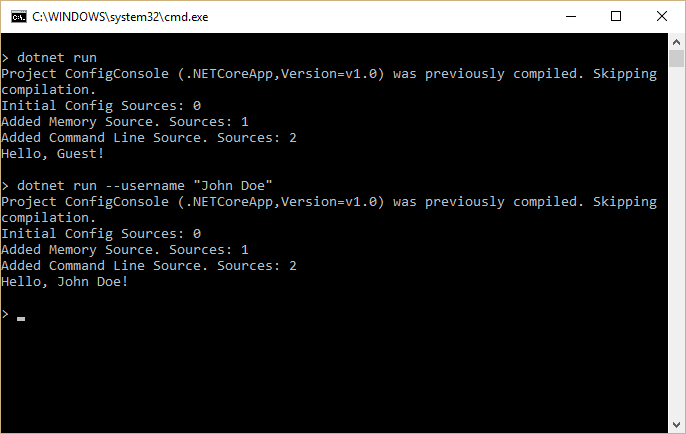
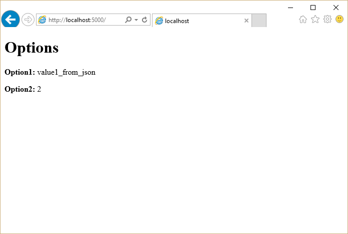
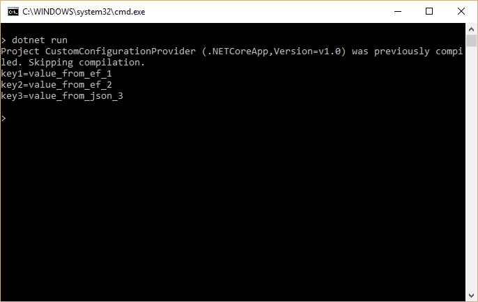

<a name=fundamentals-configuration></a>

# Configuration

[Steve Smith](http://ardalis.com), [Daniel Roth](https://github.com/danroth27)

ASP.NET Core supports a variety of different configuration options. Application configuration data can come from files using built-in support for JSON, XML, and INI formats, as well as from environment variables, command line arguments or an in-memory collection. You can also write your own [custom configuration provider](xref:fundamentals/configuration#custom-config-providers).

[View or download sample code](https://github.com/aspnet/docs/tree/master/aspnet/fundamentals/configuration/sample)

## Getting and setting configuration settings

ASP.NET Core's configuration system has been re-architected from previous versions of ASP.NET, which relied on `System.Configuration` and XML configuration files like `web.config`. The new configuration model provides streamlined access to key/value based settings that can be retrieved from a variety of sources. Applications and frameworks can then access configured settings in a strongly typed fashion using the new [Options pattern](xref:fundamentals/configuration#options-config-objects).

To work with settings in your ASP.NET application, it is recommended that you only instantiate a `Configuration` in your application's `Startup` class. Then, use the [Options pattern](xref:fundamentals/configuration#options-config-objects) to access individual settings.

At its simplest, `Configuration` is just a collection of sources, which provide the ability to read and write name/value pairs. If a name/value pair is written to `Configuration`, it is not persisted. This means that the written value will be lost when the sources are read again.

You must configure at least one source in order for `Configuration` to function correctly. The following sample shows how to test working with `Configuration` as a key/value store:

<!-- literal_block {"xml:space": "preserve", "backrefs": [], "source": "/Users/shirhatti/docs/Docs/aspnet/fundamentals/configuration/sample/src/CodeSnippets/ConfigSummarySnippet.cs", "ids": [], "dupnames": [], "names": [], "classes": [], "linenos": false, "language": "c#", "highlight_args": {"linenostart": 1}} -->

````c#

   var builder = new ConfigurationBuilder();
   builder.AddInMemoryCollection();
   var config = builder.Build();
   config["somekey"] = "somevalue";

   // do some other work

   var setting = config["somekey"]; // also returns "somevalue"

   ````

> [!NOTE]
> You must set at least one configuration source.

It's not unusual to store configuration values in a hierarchical structure, especially when using external files (e.g. JSON, XML, INI). In this case, configuration values can be retrieved using a `:` separated key, starting from the root of the hierarchy. For example, consider the following *appsettings.json* file:

<a name=config-json></a>

<!-- literal_block {"xml:space": "preserve", "backrefs": [], "source": "/Users/shirhatti/docs/Docs/common/samples/WebApplication1/src/WebApplication1/appsettings.json", "ids": ["config-json"], "dupnames": [], "names": ["config-json"], "classes": [], "linenos": false, "language": "json", "highlight_args": {"linenostart": 1}} -->

````json

   {
     "ConnectionStrings": {
       "DefaultConnection": "Server=(localdb)\\mssqllocaldb;Database=aspnet-WebApplication1-26e8893e-d7c0-4fc6-8aab-29b59971d622;Trusted_Connection=True;MultipleActiveResultSets=true"
     },
     "Logging": {
       "IncludeScopes": false,
       "LogLevel": {
         "Default": "Debug",
         "System": "Information",
         "Microsoft": "Information"
       }
     }
   }

   ````

The application uses configuration to configure the right connection string. Access to the `DefaultConnection` setting is achieved through this key: `ConnectionStrings:DefaultConnection`, or by using the [GetConnectionString](http://docs.asp.net/projects/api/en/latest/autoapi/Microsoft/Extensions/Configuration/ConfigurationExtensions/index.html.md#Microsoft.Extensions.Configuration.ConfigurationExtensions.GetConnectionString.md) extension method and passing in `"DefaultConnection"`.

The settings required by your application and the mechanism used to specify those settings (configuration being one example) can be decoupled using the [options pattern](xref:fundamentals/configuration#options-config-objects). To use the options pattern you create your own options class (probably several different classes, corresponding to different cohesive groups of settings) that you can inject into your application using an options service. You can then specify your settings using configuration or whatever mechanism you choose.

> [!NOTE]
> You could store your `Configuration` instance as a service, but this would unnecessarily couple your application to a single configuration system and specific configuration keys. Instead, you can use the [Options pattern](xref:fundamentals/configuration#options-config-objects) to avoid these issues.

## Using the built-in sources

The configuration framework has built-in support for JSON, XML, and INI configuration files, as well as support for in-memory configuration (directly setting values in code) and the ability to pull configuration from environment variables and command line parameters. Developers are not limited to using a single configuration source. In fact several may be set up together such that a default configuration is overridden by settings from another source if they are present.

Adding support for additional configuration sources is accomplished through extension methods. These methods can be called on a [ConfigurationBuilder](http://docs.asp.net/projects/api/en/latest/autoapi/Microsoft/Extensions/Configuration/ConfigurationBuilder/index.html.md#Microsoft.Extensions.Configuration.ConfigurationBuilder.md) instance in a standalone fashion, or chained together as a fluent API. Both of these approaches are demonstrated in the sample below.

<a name=custom-config></a>

<!-- literal_block {"xml:space": "preserve", "backrefs": [], "source": "/Users/shirhatti/docs/Docs/aspnet/fundamentals/configuration/sample/src/CustomConfigurationProvider/Program.cs", "ids": ["custom-config"], "dupnames": [], "names": ["custom-config"], "classes": [], "linenos": false, "language": "c#", "highlight_args": {"linenostart": 1}} -->

````c#

   // work with with a builder using multiple calls
   var builder = new ConfigurationBuilder();
   builder.SetBasePath(Directory.GetCurrentDirectory());
   builder.AddJsonFile("appsettings.json");
   var connectionStringConfig = builder.Build();

   // chain calls together as a fluent API
   var config = new ConfigurationBuilder()
       .SetBasePath(Directory.GetCurrentDirectory())
       .AddJsonFile("appsettings.json")
       .AddEntityFrameworkConfig(options =>
           options.UseSqlServer(connectionStringConfig.GetConnectionString("DefaultConnection"))
       )
       .Build();

   ````

The order in which configuration sources are specified is important, as this establishes the precedence with which settings will be applied if they exist in multiple locations. In the example below, if the same setting exists in both *appsettings.json* and in an environment variable, the setting from the environment variable will be the one that is used. The last configuration source specified "wins" if a setting exists in more than one location. The ASP.NET team recommends specifying environment variables last, so that the local environment can override anything set in deployed configuration files.

> [!NOTE]
> To override nested keys through environment variables in shells that don't support `:` in variable names, replace them with `__` (double underscore).

It can be useful to have environment-specific configuration files. This can be achieved using the following:

<!-- literal_block {"xml:space": "preserve", "backrefs": [], "source": "/Users/shirhatti/docs/Docs/common/samples/WebApplication1/src/WebApplication1/Startup.cs", "ids": [], "dupnames": [], "names": [], "classes": [], "linenos": false, "language": "none", "highlight_args": {"hl_lines": [6], "linenostart": 1}} -->

````none

   public Startup(IHostingEnvironment env)
   {
       var builder = new ConfigurationBuilder()
           .SetBasePath(env.ContentRootPath)
           .AddJsonFile("appsettings.json", optional: true, reloadOnChange: true)
           .AddJsonFile($"appsettings.{env.EnvironmentName}.json", optional: true);

       if (env.IsDevelopment())
       {
           // For more details on using the user secret store see http://go.microsoft.com/fwlink/?LinkID=532709
           builder.AddUserSecrets();
       }

       builder.AddEnvironmentVariables();
       Configuration = builder.Build();
   }

   ````

The [IHostingEnvironment](http://docs.asp.net/projects/api/en/latest/autoapi/Microsoft/AspNetCore/Hosting/IHostingEnvironment/index.html.md#Microsoft.AspNetCore.Hosting.IHostingEnvironment.md) service is used to get the current environment. In the `Development` environment, the highlighted line of code above would look for a file named `appsettings.Development.json` and use its values, overriding any other values, if it's present. Learn more about [Working with Multiple Environments](environments.md).

When specifying files as configuration sources, you can optionally specify whether changes to the file should result in the settings being reloaded. This is configured by passing in a `true` value for the `reloadOnChange` parameter when calling [AddJsonFile](http://docs.asp.net/projects/api/en/latest/autoapi/Microsoft/Extensions/Configuration/JsonConfigurationExtensions/index.html.md#Microsoft.Extensions.Configuration.JsonConfigurationExtensions.AddJsonFile.md) or similar file-based extension methods.

>[!WARNING]
> You should never store passwords or other sensitive data in configuration provider code or in plain text configuration files. You also shouldn't use production secrets in your development or test environments. Instead, such secrets should be specified outside the project tree, so they cannot be accidentally committed into the configuration provider repository. Learn more about [Working with Multiple Environments](environments.md) and managing [Safe storage of app secrets during development](../security/app-secrets.md).

One way to leverage the order precedence of `Configuration` is to specify default values, which can be overridden. In the console application below, a default value for the `username` setting is specified in an in-memory collection, but this is overridden if a command line argument for `username` is passed to the application. You can see in the output how many different configuration sources are configured in the application at each stage of its execution.

<!-- literal_block {"xml:space": "preserve", "backrefs": [], "source": "/Users/shirhatti/docs/Docs/aspnet/fundamentals/configuration/sample/src/ConfigConsole/Program.cs", "ids": [], "dupnames": [], "names": [], "classes": [], "linenos": true, "language": "none", "highlight_args": {"hl_lines": [22, 25], "linenostart": 1}} -->

````none

   using System;
   using System.Collections.Generic;
   using System.Linq;
   using Microsoft.Extensions.Configuration;

   namespace ConfigConsole
   {
       public static class Program
       {
           public static void Main(string[] args)
           {
               var builder = new ConfigurationBuilder();
               Console.WriteLine("Initial Config Sources: " + builder.Sources.Count());

               builder.AddInMemoryCollection(new Dictionary<string, string>
               {
                   { "username", "Guest" }
               });

               Console.WriteLine("Added Memory Source. Sources: " + builder.Sources.Count());

               builder.AddCommandLine(args);
               Console.WriteLine("Added Command Line Source. Sources: " + builder.Sources.Count());

               var config = builder.Build();
               string username = config["username"];

               Console.WriteLine($"Hello, {username}!");
           }
       }
   }

   ````

When run, the program will display the default value unless a command line parameter overrides it.



<a name=options-config-objects></a>

## Using Options and configuration objects

The options pattern enables using custom options classes to represent a group of related settings. A class needs to have a public read-write property for each setting and a constructor that does not take any parameters (e.g. a default constructor) in order to be used as an options class.

It's recommended that you create well-factored settings objects that correspond to certain features within your application, thus following the [Interface Segregation Principle (ISP)](http://deviq.com/interface-segregation-principle/) (classes depend only on the configuration settings they use) as well as [Separation of Concerns](http://deviq.com/separation-of-concerns/) (settings for disparate parts of your app are managed separately, and thus are less likely to negatively impact one another).

A simple `MyOptions` class is shown here:

<!-- literal_block {"xml:space": "preserve", "backrefs": [], "source": "/Users/shirhatti/docs/Docs/aspnet/fundamentals/configuration/sample/src/UsingOptions/Models/MyOptions.cs", "ids": [], "dupnames": [], "names": [], "classes": [], "linenos": false, "language": "c#", "highlight_args": {"linenostart": 1}} -->

````c#

   public class MyOptions
   {
       public string Option1 { get; set; }
       public int Option2 { get; set; }
   }

   ````

Options can be injected into your application using the [IOptions<TOptions>](http://docs.asp.net/projects/api/en/latest/autoapi/Microsoft/Extensions/Options/IOptions-TOptions/index.html.md#Microsoft.Extensions.Options.IOptions<TOptions>.md) accessor service. For example, the following [controller](../mvc/controllers/index.md)  uses `IOptions<MyOptions>` to access the settings it needs to render the `Index` view:

<!-- literal_block {"xml:space": "preserve", "backrefs": [], "source": "/Users/shirhatti/docs/Docs/aspnet/fundamentals/configuration/sample/src/UsingOptions/Controllers/HomeController.cs", "ids": [], "dupnames": [], "names": [], "classes": [], "linenos": false, "language": "c#", "highlight_args": {"hl_lines": [3, 5, 8], "linenostart": 1}} -->

````c#

   public class HomeController : Controller
   {
       private readonly IOptions<MyOptions> _optionsAccessor;

       public HomeController(IOptions<MyOptions> optionsAccessor)
       {
           _optionsAccessor = optionsAccessor;
       }

       // GET: /<controller>/
       public IActionResult Index() => View(_optionsAccessor.Value);
   }

   ````

>[!TIP]
> Learn more about [Dependency Injection](dependency-injection.md).

To setup the [IOptions<TOptions>](http://docs.asp.net/projects/api/en/latest/autoapi/Microsoft/Extensions/Options/IOptions-TOptions/index.html.md#Microsoft.Extensions.Options.IOptions<TOptions>.md) service you call the [AddOptions](http://docs.asp.net/projects/api/en/latest/autoapi/Microsoft/Extensions/DependencyInjection/OptionsServiceCollectionExtensions/index.html.md#Microsoft.Extensions.DependencyInjection.OptionsServiceCollectionExtensions.AddOptions.md) extension method during startup in your `ConfigureServices` method:

<!-- literal_block {"xml:space": "preserve", "backrefs": [], "source": "/Users/shirhatti/docs/Docs/aspnet/fundamentals/configuration/sample/src/UsingOptions/Startup.cs", "ids": [], "dupnames": [], "names": [], "classes": [], "linenos": false, "language": "c#", "highlight_args": {"hl_lines": [4], "linenostart": 1}} -->

````c#

   public void ConfigureServices(IServiceCollection services)
   {
       // Setup options with DI
       services.AddOptions();


   ````

<a name=options-example></a>

The `Index` view displays the configured options:



You configure options using the [Configure<TOptions>](http://docs.asp.net/projects/api/en/latest/autoapi/Microsoft/Extensions/DependencyInjection/OptionsServiceCollectionExtensions/index.html.md#Microsoft.Extensions.DependencyInjection.OptionsServiceCollectionExtensions.Configure<TOptions>.md) extension method. You can configure options using a delegate or by binding your options to configuration:

<!-- literal_block {"xml:space": "preserve", "backrefs": [], "source": "/Users/shirhatti/docs/Docs/aspnet/fundamentals/configuration/sample/src/UsingOptions/Startup.cs", "ids": [], "dupnames": [], "names": [], "classes": [], "linenos": false, "language": "c#", "highlight_args": {"hl_lines": [7, 10, 11, 12, 13, 16], "linenostart": 1}} -->

````c#

   public void ConfigureServices(IServiceCollection services)
   {
       // Setup options with DI
       services.AddOptions();

       // Configure MyOptions using config by installing Microsoft.Extensions.Options.ConfigurationExtensions
       services.Configure<MyOptions>(Configuration);

       // Configure MyOptions using code
       services.Configure<MyOptions>(myOptions =>
       {
           myOptions.Option1 = "value1_from_action";
       });

       // Configure MySubOptions using a sub-section of the appsettings.json file
       services.Configure<MySubOptions>(Configuration.GetSection("subsection"));

       // Add framework services.
       services.AddMvc();
   }

   ````

When you bind options to configuration, each property in your options type is bound to a configuration key of the form `property:subproperty:...`. For example, the `MyOptions.Option1` property is bound to the key `Option1`, which is read from the `option1` property in *appsettings.json*. Note that configuration keys are case insensitive.

Each call to [Configure<TOptions>](http://docs.asp.net/projects/api/en/latest/autoapi/Microsoft/Extensions/DependencyInjection/OptionsServiceCollectionExtensions/index.html.md#Microsoft.Extensions.DependencyInjection.OptionsServiceCollectionExtensions.Configure<TOptions>.md) adds an [IConfigureOptions<TOptions>](http://docs.asp.net/projects/api/en/latest/autoapi/Microsoft/Extensions/Options/IConfigureOptions-TOptions/index.html.md#Microsoft.Extensions.Options.IConfigureOptions<TOptions>.md) service to the service container that is used by the [IOptions<TOptions>](http://docs.asp.net/projects/api/en/latest/autoapi/Microsoft/Extensions/Options/IOptions-TOptions/index.html.md#Microsoft.Extensions.Options.IOptions<TOptions>.md) service to provide the configured options to the application or framework. If you want to configure your options using objects that must be obtained from the service container (for example, to read settings from a database) you can use the
`AddSingleton<IConfigureOptions<TOptions>>` extension method to register a custom [IConfigureOptions<TOptions>](http://docs.asp.net/projects/api/en/latest/autoapi/Microsoft/Extensions/Options/IConfigureOptions-TOptions/index.html.md#Microsoft.Extensions.Options.IConfigureOptions<TOptions>.md) service.

You can have multiple [IConfigureOptions<TOptions>](http://docs.asp.net/projects/api/en/latest/autoapi/Microsoft/Extensions/Options/IConfigureOptions-TOptions/index.html.md#Microsoft.Extensions.Options.IConfigureOptions<TOptions>.md) services for the same option type and they are all applied in order. In the [example](xref:fundamentals/configuration#options-example) above, the values of `Option1` and `Option2` are both specified in *appsettings.json*, but the value of `Option1` is overridden by the configured delegate with the value "value1_from_action".

<a name=custom-config-providers></a>

## Writing custom providers

In addition to using the built-in configuration providers, you can also write your own. To do so, you simply implement the [IConfigurationSource](http://docs.asp.net/projects/api/en/latest/autoapi/Microsoft/Extensions/Configuration/IConfigurationSource/index.html.md#Microsoft.Extensions.Configuration.IConfigurationSource.md) interface, which exposes a [Build](http://docs.asp.net/projects/api/en/latest/autoapi/Microsoft/Extensions/Configuration/IConfigurationSource/index.html.md#Microsoft.Extensions.Configuration.IConfigurationSource.Build.md) method. The build method configures and returns an [IConfigurationProvider](http://docs.asp.net/projects/api/en/latest/autoapi/Microsoft/Extensions/Configuration/IConfigurationProvider/index.html.md#Microsoft.Extensions.Configuration.IConfigurationProvider.md).

### Example: Entity Framework Settings

You may wish to store some of your application's settings in a database, and access them using Entity Framework Core (EF). There are many ways in which you could choose to store such values, ranging from a simple table with a column for the setting name and another column for the setting value, to having separate columns for each setting value. In this example, we're going to create a simple configuration provider that reads name-value pairs from a database using EF.

To start off we'll define a simple `ConfigurationValue` entity for storing configuration values in the database:

<!-- literal_block {"xml:space": "preserve", "backrefs": [], "source": "/Users/shirhatti/docs/Docs/aspnet/fundamentals/configuration/sample/src/CustomConfigurationProvider/ConfigurationValue.cs", "ids": [], "dupnames": [], "names": [], "classes": [], "linenos": false, "language": "c#", "highlight_args": {"linenostart": 1}} -->

````c#

   public class ConfigurationValue
   {
       public string Id { get; set; }
       public string Value { get; set; }
   }

   ````

You need a `ConfigurationContext` to store and access the configured values using EF:

<!-- literal_block {"xml:space": "preserve", "backrefs": [], "source": "/Users/shirhatti/docs/Docs/aspnet/fundamentals/configuration/sample/src/CustomConfigurationProvider/ConfigurationContext.cs", "ids": [], "dupnames": [], "names": [], "classes": [], "linenos": false, "language": "c#", "highlight_args": {"hl_lines": [7], "linenostart": 1}} -->

````c#

   public class ConfigurationContext : DbContext
   {
       public ConfigurationContext(DbContextOptions options) : base(options)
       {
       }

       public DbSet<ConfigurationValue> Values { get; set; }
   }

   ````

Create an `EntityFrameworkConfigurationSource` that inherits from [IConfigurationSource](http://docs.asp.net/projects/api/en/latest/autoapi/Microsoft/Extensions/Configuration/IConfigurationSource/index.html.md#Microsoft.Extensions.Configuration.IConfigurationSource.md):

<!-- literal_block {"xml:space": "preserve", "backrefs": [], "source": "/Users/shirhatti/docs/Docs/aspnet/fundamentals/configuration/sample/src/CustomConfigurationProvider/EntityFrameworkConfigurationSource.cs", "ids": [], "dupnames": [], "names": [], "classes": [], "linenos": false, "language": "c#", "highlight_args": {"hl_lines": [7, 16, 17, 18, 19], "linenostart": 1}} -->

````c#

   using System;
   using Microsoft.EntityFrameworkCore;
   using Microsoft.Extensions.Configuration;

   namespace CustomConfigurationProvider
   {
       public class EntityFrameworkConfigurationSource : IConfigurationSource
       {
           private readonly Action<DbContextOptionsBuilder> _optionsAction;

           public EntityFrameworkConfigurationSource(Action<DbContextOptionsBuilder> optionsAction)
           {
               _optionsAction = optionsAction;
           }

           public IConfigurationProvider Build(IConfigurationBuilder builder)
           {
               return new EntityFrameworkConfigurationProvider(_optionsAction);
           }
       }
   }
   ````

Next, create the custom configuration provider by inheriting from [ConfigurationProvider](http://docs.asp.net/projects/api/en/latest/autoapi/Microsoft/Extensions/Configuration/ConfigurationProvider/index.html.md#Microsoft.Extensions.Configuration.ConfigurationProvider.md). The configuration data is loaded by overriding the `Load` method, which reads in all of the configuration data from the configured database. For demonstration purposes, the configuration provider also takes care of initializing the database if it hasn't already been created and populated:

<!-- literal_block {"xml:space": "preserve", "backrefs": [], "source": "/Users/shirhatti/docs/Docs/aspnet/fundamentals/configuration/sample/src/CustomConfigurationProvider/EntityFrameworkConfigurationProvider.cs", "ids": [], "dupnames": [], "names": [], "classes": [], "linenos": false, "language": "c#", "highlight_args": {"hl_lines": [9, 18, 19, 20, 21, 22, 23, 24, 25, 26, 27, 28, 29, 30, 37, 38], "linenostart": 1}} -->

````c#

   using System;
   using System.Collections.Generic;
   using System.Linq;
   using Microsoft.EntityFrameworkCore;
   using Microsoft.Extensions.Configuration;

   namespace CustomConfigurationProvider
   {
       public class EntityFrameworkConfigurationProvider : ConfigurationProvider
       {
           public EntityFrameworkConfigurationProvider(Action<DbContextOptionsBuilder> optionsAction)
           {
               OptionsAction = optionsAction;
           }

           Action<DbContextOptionsBuilder> OptionsAction { get; }

           public override void Load()
           {
               var builder = new DbContextOptionsBuilder<ConfigurationContext>();
               OptionsAction(builder);

               using (var dbContext = new ConfigurationContext(builder.Options))
               {
                   dbContext.Database.EnsureCreated();
                   Data = !dbContext.Values.Any()
                       ? CreateAndSaveDefaultValues(dbContext)
                       : dbContext.Values.ToDictionary(c => c.Id, c => c.Value);
               }
           }

           private static IDictionary<string, string> CreateAndSaveDefaultValues(
               ConfigurationContext dbContext)
           {
               var configValues = new Dictionary<string, string>
                   {
                       { "key1", "value_from_ef_1" },
                       { "key2", "value_from_ef_2" }
                   };
               dbContext.Values.AddRange(configValues
                   .Select(kvp => new ConfigurationValue { Id = kvp.Key, Value = kvp.Value })
                   .ToArray());
               dbContext.SaveChanges();
               return configValues;
           }
       }
   }

   ````

Note the values that are being stored in the database ("value_from_ef_1" and "value_from_ef_2"); these are displayed in the sample below to demonstrate the configuration is reading values from the database properly.

By convention you can also add an `AddEntityFrameworkConfiguration` extension method for adding the configuration source:

<!-- literal_block {"xml:space": "preserve", "backrefs": [], "source": "/Users/shirhatti/docs/Docs/aspnet/fundamentals/configuration/sample/src/CustomConfigurationProvider/EntityFrameworkExtensions.cs", "ids": [], "dupnames": [], "names": [], "classes": [], "linenos": false, "language": "c#", "highlight_args": {"hl_lines": [9], "linenostart": 1}} -->

````c#

   using System;
   using Microsoft.EntityFrameworkCore;
   using Microsoft.Extensions.Configuration;

   namespace CustomConfigurationProvider
   {
       public static class EntityFrameworkExtensions
       {
           public static IConfigurationBuilder AddEntityFrameworkConfig(
               this IConfigurationBuilder builder, Action<DbContextOptionsBuilder> setup)
           {
               return builder.Add(new EntityFrameworkConfigurationSource(setup));
           }
       }
   }
   ````

You can see an example of how to use this custom configuration provider in your application in the following example. Create a new [ConfigurationBuilder](http://docs.asp.net/projects/api/en/latest/autoapi/Microsoft/Extensions/Configuration/ConfigurationBuilder/index.html.md#Microsoft.Extensions.Configuration.ConfigurationBuilder.md) to set up your configuration sources. To add the `EntityFrameworkConfigurationProvider`, you first need to specify the EF data provider and connection string. How should you configure the connection string? Using configuration of course! Add an *appsettings.json* file as a configuration source to bootstrap setting up the `EntityFrameworkConfigurationProvider`. By adding the database settings to an existing configuration with other sources specified, any settings specified in the database will override settings specified in *appsettings.json*:

<!-- literal_block {"xml:space": "preserve", "backrefs": [], "source": "/Users/shirhatti/docs/Docs/aspnet/fundamentals/configuration/sample/src/CustomConfigurationProvider/Program.cs", "ids": [], "dupnames": [], "names": [], "classes": [], "linenos": false, "language": "c#", "highlight_args": {"hl_lines": [21, 22, 23, 24], "linenostart": 1}} -->

````c#

   using System;
   using System.IO;
   using Microsoft.EntityFrameworkCore;
   using Microsoft.Extensions.Configuration;

   namespace CustomConfigurationProvider
   {
       public static class Program
       {
           public static void Main()
           {
               // work with with a builder using multiple calls
               var builder = new ConfigurationBuilder();
               builder.SetBasePath(Directory.GetCurrentDirectory());
               builder.AddJsonFile("appsettings.json");
               var connectionStringConfig = builder.Build();

               // chain calls together as a fluent API
               var config = new ConfigurationBuilder()
                   .SetBasePath(Directory.GetCurrentDirectory())
                   .AddJsonFile("appsettings.json")
                   .AddEntityFrameworkConfig(options =>
                       options.UseSqlServer(connectionStringConfig.GetConnectionString("DefaultConnection"))
                   )
                   .Build();

               Console.WriteLine("key1={0}", config["key1"]);
               Console.WriteLine("key2={0}", config["key2"]);
               Console.WriteLine("key3={0}", config["key3"]);
           }
       }
   }

   ````

Run the application to see the configured values:



## Summary

ASP.NET Core provides a very flexible configuration model that supports a number of different file-based options, as well as command-line, in-memory, and environment variables. It works seamlessly with the options model so that you can inject strongly typed settings into your application or framework. You can create your own custom configuration providers as well, which can work with or replace the built-in providers, allowing for extreme flexibility.
