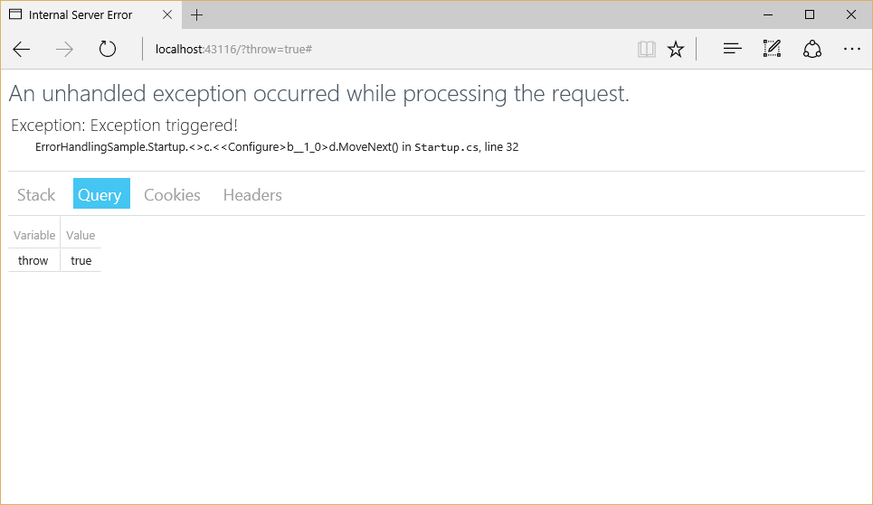
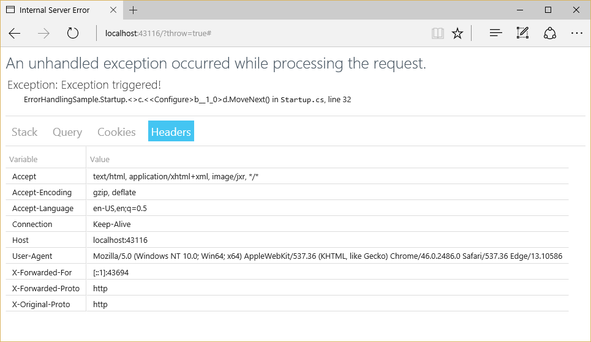
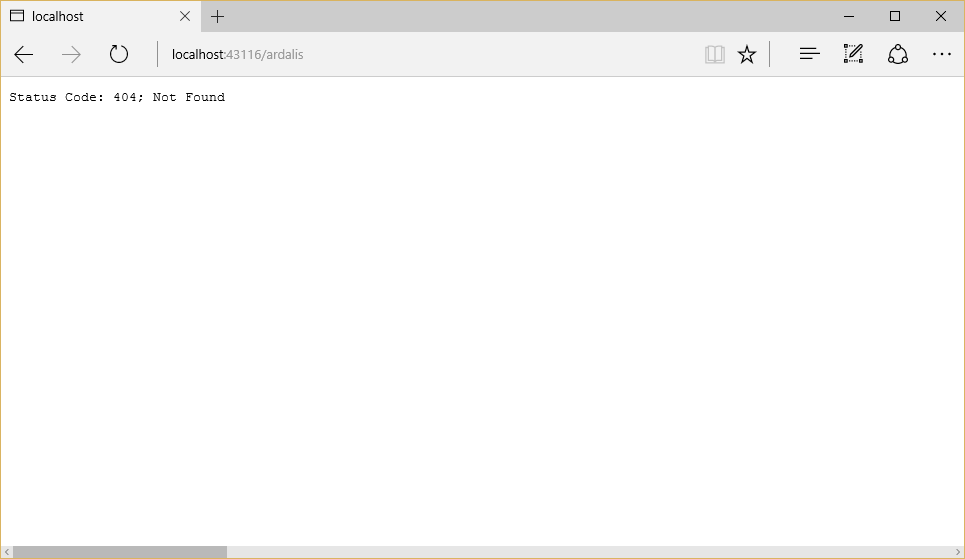

---
uid: fundamentals/error-handling
---
>[!WARNING]
> This page documents version 1.0.0-rc1 and has not yet been updated for version 1.0.0

# Error Handling

By [Steve Smith](http://ardalis.com)

When errors occur in your ASP.NET app, you can handle them in a variety of ways, as described in this article.

[View or download sample code](https://github.com/aspnet/Docs/tree/master/aspnet/fundamentals/error-handling/sample)

## Configuring an Exception Handling Page

You configure the pipeline for each request in the `Startup` class's `Configure()` method (learn more about [Application Startup](startup.md)). You can add a simple exception page, meant only for use during development, very easily. All that's required is to add a dependency on `Microsoft.AspNetCore.Diagnostics` to the project and then add one line to `Configure()` in `Startup.cs`:

[!code-csharp[Main](../fundamentals/error-handling/sample/src/ErrorHandlingSample/Startup.cs?highlight=6,8)]

````csharp

   public void Configure(IApplicationBuilder app, 
       IHostingEnvironment env)
   {
       app.UseIISPlatformHandler();

       if (env.IsDevelopment())
       {
           app.UseDeveloperExceptionPage();
       }

   ````

The above code includes a check to ensure the environment is development before adding the call to `UseDeveloperExceptionPage`. This is a good practice, since you typically do not want to share detailed exception information about your application publicly while it is in production. [Learn more about configuring environments](environments.md).

The sample application includes a simple mechanism for creating an exception:

[!code-csharp[Main](../fundamentals/error-handling/sample/src/ErrorHandlingSample/Startup.cs?highlight=5,6,7,8)]

````csharp

   public static void HomePage(IApplicationBuilder app)
   {
       app.Run(async (context) =>
       {
           if (context.Request.Query.ContainsKey("throw"))
           {
               throw new Exception("Exception triggered!");
           }
           var builder = new StringBuilder();
           builder.AppendLine("<html><body>Hello World!");
           builder.AppendLine("<ul>");
           builder.AppendLine("<li><a href=\"/?throw=true\">Throw Exception</a></li>");
           builder.AppendLine("<li><a href=\"/missingpage\">Missing Page</a></li>");
           builder.AppendLine("</ul>");
           builder.AppendLine("</body></html>");

           context.Response.ContentType = "text/html";
           await context.Response.WriteAsync(builder.ToString());
       });
   }

   ````

If a request includes a non-empty querystring parameter for the variable `throw` (e.g. a path of `/?throw=true`), an exception will be thrown. If the environment is set to `Development`, the developer exception page is displayed:


When not in development, it's a good idea to configure an exception handler path using the `UseExceptionHandler` middleware:

````csharp

   app.UseExceptionHandler("/Error");
   ````

For the action associated with the endpoint, don't explicitly decorate the `IActionResult` with HTTP method attributes, such as `HttpGet`. Using explicit verbs could prevent some requests from reaching the method.

````csharp

   [Route("/Error")]
   public IActionResult Index()
   {
       // Handle error here
   }
   ````

## Using the Developer Exception Page

The developer exception page displays useful diagnostics information when an unhandled exception occurs within the web processing pipeline. The page includes several tabs with information about the exception that was triggered and the request that was made. The first tab includes a stack trace:


The next tab shows the query string parameters, if any:



In this case, you can see the value of the `throw` parameter that was passed to this request. This request didn't have any cookies, but if it did, they would appear on the Cookies tab. You can see the headers that were passed in the last tab:



<a name=status-code-pages></a>

## Configuring Status Code Pages

By default, your app will not provide a rich status code page for HTTP status codes such as 500 (Internal Server Error) or 404 (Not Found). You can configure the `StatusCodePagesMiddleware` adding this line to the `Configure` method:

````csharp

   app.UseStatusCodePages();
   ````

By default, this middleware adds very simple, text-only handlers for common status codes. For example, the following is the result of a 404 Not Found status code:



The middleware supports several different extension methods. You can pass it a custom lamdba expression:

````csharp

   app.UseStatusCodePages(context =>
     context.HttpContext.Response.SendAsync("Handler, status code: " +
     context.HttpContext.Response.StatusCode, "text/plain"));
   ````

Alternately, you can simply pass it a content type and a format string:

````csharp

   app.UseStatusCodePages("text/plain", "Response, status code: {0}");
   ````

The middleware can handle redirects (with either relative or absolute URL paths), passing the status code as part of the URL:

````csharp

   app.UseStatusCodePagesWithRedirects("~/errors/{0}");
   ````

In the above case, the client browser will see a `302 / Found` status and will redirect to the URL provided.

Alternately, the middleware can re-execute the request from a new path format string:

````csharp

   app.UseStatusCodePagesWithReExecute("/errors/{0}");
   ````

The `UseStatusCodePagesWithReExecute` method will still return the original status code to the browser, but will also execute the handler given at the path specified.

If you need to disable status code pages for certain requests, you can do so using the following code:

````csharp

   var statusCodePagesFeature = context.Features.Get<IStatusCodePagesFeature>();
   if (statusCodePagesFeature != null)
   {
     statusCodePagesFeature.Enabled = false;
   }
   ````

## Limitations of Exception Handling During Client-Server Interaction

Web apps have certain limitations to their exception handling capabilities because of the nature of disconnected HTTP requests and responses. Keep these in mind as you design your app's exception handling behavior.

1. Once the headers for a response have been sent, you cannot change the response's status code, nor can any exception pages or handlers run. The response must be completed or the connection aborted.

2. If the client disconnects mid-response, you cannot send them the rest of the content of that response.

3. There is always the possibility of an exception occuring one layer below your exception handling layer.

4. Don't forget, exception handling pages can have exceptions, too. It's often a good idea for production error pages to consist of purely static content.

Following the above recommendations will help ensure your app remains responsive and is able to gracefully handle exceptions that may occur.

## Server Exception Handling

In addition to the exception handling logic in your app, the server hosting your app will perform some exception handling. If the server catches an exception before the headers have been sent it will send a 500 Internal Server Error response with no body. If it catches an exception after the headers have been sent it must close the connection. Requests that are not handled by your app will be handled by the server, and any exception that occurs will be handled by the server's exception handling. Any custom error pages or exception handling middleware or filters you have configured for your app will not affect this behavior.

<a name=startup-error-handling></a>

## Startup Exception Handling

One of the trickiest places to handle exceptions in your app is during its startup. Only the hosting layer can handle exceptions that take place during app startup. Exceptions that occur in your app's startup can also impact server behavior. For example, to enable SSL in Kestrel, one must configure the server with `KestrelServerOptions.UseHttps()`. If an exception happens before this line in `Startup`, then by default hosting will catch the exception, start the server, and display an error page on the non-SSL port. If an exception happens after that line executes, then the error page will be served over HTTPS instead.

## ASP.NET MVC Error Handling

[MVC](../mvc/index.md) apps have some additional options when it comes to handling errors, such as configuring exception filters and performing model validation.

### Exception Filters

Exception filters can be configured globally or on a per-controller or per-action basis in an [MVC](../mvc/index.md) app. These filters handle any unhandled exception that occurs during the execution of a controller action or another filter, and are not called otherwise. Exception filters are detailed in [filters](../mvc/controllers/filters.md).

>[!TIP]
> Exception filters are good for trapping exceptions that occur within MVC actions, but they're not as flexible as error handling middleware. Prefer middleware for the general case, and use filters only where you need to do error handling *differently* based on which MVC action was chosen.

### Handling Model State Errors

[Model validation](../mvc/models/validation.md) occurs prior to each controller action being invoked, and it is the action method’s responsibility to inspect `ModelState.IsValid` and react appropriately. In many cases, the appropriate reaction is to return some kind of error response, ideally detailing the reason why model validation failed.

Some apps will choose to follow a standard convention for dealing with model validation errors, in which case a [filter](../mvc/controllers/filters.md) may be an appropriate place to implement such a policy. You should test how your actions behave with valid and invalid model states (learn more about [testing controller logic](../mvc/controllers/testing.md)).
