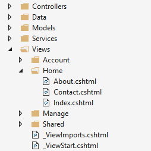
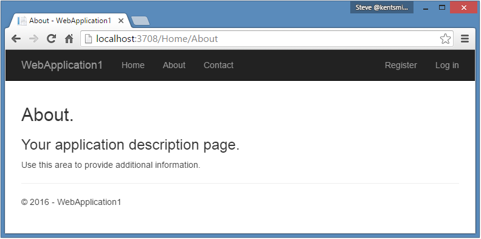

# Views Overview

By [Steve Smith](http://ardalis.com)

ASP.NET MVC Core controllers can return formatted results using *views*.

## What are Views?

In the Model-View-Controller (MVC) pattern, the *view* encapsulates the presentation details of the user's interaction with the app. Views are HTML templates with embedded code that generate content to send to the client. Views use [Razor syntax](razor.md), which allows code to interact with HTML with minimal code or ceremony.

ASP.NET Core MVC views are *.cshtml* files stored by default in a *Views* folder within the application. Typically, each controller will have its own folder, in which are views for specific controller actions.



In addition to action-specific views, [partial views](partial.md), [layouts, and other special view files](layout.md) can be used to help reduce repetition and allow for reuse within the app's views.

## Benefits of Using Views

Views provide [separation of concerns](http://deviq.com/separation-of-concerns/) within an MVC app, encapsulating user interface level markup separately from business logic. ASP.NET MVC views use [Razor syntax](razor.md) to make switching between HTML markup and server side logic painless. Common, repetitive aspects of the app's user interface can easily be reused between views using [layout and shared directives](layout.md) or [partial views](partial.md).

## Creating a View

Views that are specific to a controller are created in the *Views/[ControllerName]* folder. Views that are shared among controllers are placed in the */Views/Shared* folder. Name the view file the same as its associated controller action, and add the *.cshtml* file extension. For example, to create a view for the *About* action on the *Home* controller, you would create the *About.cshtml* file in the */Views/Home* folder.

A sample view file (*About.cshtml*):

<!-- literal_block {"xml:space": "preserve", "backrefs": [], "source": "/Users/shirhatti/docs/Docs/common/samples/WebApplication1/src/WebApplication1/Views/Home/About.cshtml", "ids": [], "dupnames": [], "names": [], "classes": [], "linenos": false, "language": "html", "highlight_args": {"linenostart": 1}} -->

````html

   @{
       ViewData["Title"] = "About";
   }
   <h2>@ViewData["Title"].</h2>
   <h3>@ViewData["Message"]</h3>

   <p>Use this area to provide additional information.</p>

   ````

*Razor* code is denoted by the `@` symbol. C# statements are run within Razor code blocks set off by curly braces (`{` `}`), such as the assignment of "About" to the `ViewData["Title"]` element shown above. Razor can be used to display values within HTML by simply referencing the value with the `@` symbol, as shown within the `<h2>` and `<h3>` elements above.

This view focuses on just the portion of the output for which it is responsible. The rest of the page's layout, and other common aspects of the view, are specified elsewhere. Learn more about [layout and shared view logic](layout.md).

## How do Controllers Specify Views?

Views are typically returned from actions as a [ViewResult](http://docs.asp.net/projects/api/en/latest/autoapi/Microsoft/AspNetCore/Mvc/ViewResult/index.html.md#Microsoft.AspNetCore.Mvc.ViewResult.md). Your action method can create and return a `ViewResult` directly, but more commonly if your controller inherits from [Controller](http://docs.asp.net/projects/api/en/latest/autoapi/Microsoft/AspNetCore/Mvc/Controller/index.html.md#Microsoft.AspNetCore.Mvc.Controller.md), you'll simply use the `View` helper method, as this example demonstrates:

*HomeController.cs*

<!-- literal_block {"xml:space": "preserve", "backrefs": [], "source": "/Users/shirhatti/docs/Docs/common/samples/WebApplication1/src/WebApplication1/Controllers/HomeController.cs", "ids": [], "dupnames": [], "names": [], "classes": [], "linenos": false, "language": "c#", "highlight_args": {"hl_lines": [5], "linenostart": 1}} -->

````c#

       public IActionResult About()
       {
           ViewData["Message"] = "Your application description page.";

           return View();
       }

   ````

The `View` helper method has several overloads to make returning views easier for app developers. You can optionally specify a view to return, as well as a model object to pass to the view.

When this action returns, the *About.cshtml* view shown above is rendered:



### View Discovery

When an action returns a view, a process called *view discovery* takes place. This process determines which view file will be used. Unless a specific view file is specified, the runtime looks for a controller-specific view first, then looks for matching view name in the *Shared* folder.

When an action returns the `View` method, like so `return View();`, the action name is used as the view name. For example, if this were called from an action method named "Index", it would be equivalent to passing in a view name of "Index". A view name can be explicitly passed to the method (`return View("SomeView");`). In both of these cases, view discovery searches for a matching view file in:

   1. Views/<ControllerName>/<ViewName>.cshtml

   2. Views/Shared/<ViewName>.cshtml

>[!TIP]
> We recommend following the convention of simply returning `View()` from actions when possible, as it results in more flexible, easier to refactor code.

A view file path can be provided, instead of a view name. In this case, the *.cshtml* extension must be specified as part of the file path. The path should be relative to the application root (and can optionally start with "/" or "~/"). For example: `return View("Views/Home/About.cshtml");`

> [!NOTE]
> [Partial views](partial.md) and [view components](view-components.md) use similar (but not identical) discovery mechanisms.

> [!NOTE]
> You can customize the default convention regarding where views are located within the app by using a custom [IViewLocationExpander](http://docs.asp.net/projects/api/en/latest/autoapi/Microsoft/AspNetCore/Mvc/Razor/IViewLocationExpander/index.html.md#Microsoft.AspNetCore.Mvc.Razor.IViewLocationExpander.md).

>[!TIP]
> View names may be case sensitive depending on the underlying file system. For compatibility across operating systems, always match case between controller and action names and associated view folders and filenames.

## Passing Data to Views

You can pass data to views using several mechanisms. The most robust approach is to specify a *model* type in the view (commonly referred to as a *viewmodel*, to distinguish it from business domain model types), and then pass an instance of this type to the view from the action. We recommend you use a model or view model to pass data to a view. This allows the view to take advantage of strong type checking. You can specify a model for a view using the `@model` directive:

<!-- literal_block {"backrefs": [], "ids": [], "dupnames": [], "linenos": false, "names": [], "classes": [], "xml:space": "preserve", "language": "html", "highlight_args": {"hl_lines": [1]}} -->

````html

   @model WebApplication1.ViewModels.Address
   <h2>Contact</h2>
   <address>
       @Model.Street<br />
       @Model.City, @Model.State @Model.PostalCode<br />
       <abbr title="Phone">P:</abbr>
       425.555.0100
   </address>
   ````

Once a model has been specified for a view, the instance sent to the view can be accessed in a strongly-typed manner using `@Model` as shown above. To provide an instance of the model type to the view, the controller passes it as a parameter:

<!-- literal_block {"backrefs": [], "ids": [], "dupnames": [], "linenos": false, "names": [], "classes": [], "xml:space": "preserve", "language": "c#", "highlight_args": {"hl_lines": [13]}} -->

````c#

   public IActionResult Contact()
   {
       ViewData["Message"] = "Your contact page.";

       var viewModel = new Address()
       {
           Name = "Microsoft",
           Street = "One Microsoft Way",
           City = "Redmond",
           State = "WA",
           PostalCode = "98052-6399"
       };
       return View(viewModel);
   }
   ````

There are no restrictions on the types that can be provided to a view as a model. We recommend passing Plain Old CLR Object (POCO) view models with little or no behavior, so that business logic can be encapsulated elsewhere in the app. An example of this approach is the *Address* viewmodel used in the example above:

<!-- literal_block {"backrefs": [], "ids": [], "dupnames": [], "linenos": false, "names": [], "classes": [], "xml:space": "preserve", "language": "c#", "highlight_args": {"hl_lines": [13]}} -->

````c#

   namespace WebApplication1.ViewModels
   {
       public class Address
       {
           public string Name { get; set; }
           public string Street { get; set; }
           public string City { get; set; }
           public string State { get; set; }
           public string PostalCode { get; set; }
       }
   }
   ````

> [!NOTE]
> Nothing prevents you from using the same classes as your business model types and your display model types. However, keeping them separate allows your views to vary independently from your domain or persistence model, and can offer some security benefits as well (for models that users will send to the app using [model binding](../models/model-binding.md)).

### Loosely Typed Data

In addition to strongly typed views, all views have access to a loosely typed collection of data. This same collection can be referenced through either the `ViewData` or `ViewBag` properties on controllers and views. The `ViewBag` property is a wrapper around `ViewData` that provides a dynamic view over that collection. It is not a separate collection.

`ViewData` is a dictionary object accessed through `string` keys. You can store and retrieve objects in it, and you'll need to cast them to a specific type when you extract them. You can use `ViewData` to pass data from a controller to views, as well as within views (and partial views and layouts). String data can be stored and used directly, without the need for a cast.

Set some values for `ViewData` in an action:

<!-- literal_block {"backrefs": [], "ids": [], "dupnames": [], "linenos": false, "names": [], "classes": [], "xml:space": "preserve", "language": "c#", "highlight_args": {}} -->

````c#

   public IActionResult SomeAction()
   {
       ViewData["Greeting"] = "Hello";
       ViewData["Address"]  = new Address()
       {
           Name = "Steve",
           Street = "123 Main St",
           City = "Hudson",
           State = "OH",
           PostalCode = "44236"
       };

       return View();
   }
   ````

Work with the data in a view:

<!-- literal_block {"backrefs": [], "ids": [], "dupnames": [], "linenos": false, "names": [], "classes": [], "xml:space": "preserve", "language": "html", "highlight_args": {"hl_lines": [3, 6]}} -->

````html

   @{
       // Requires cast
       var address = ViewData["Address"] as Address;
   }

   @ViewData["Greeting"] World!

   <address>
       @address.Name<br />
       @address.Street<br />
       @address.City, @address.State @address.PostalCode
   </address>
   ````

The `ViewBag` objects provides dynamic access to the objects stored in `ViewData`. This can be more convenient to work with, since it doesn't require casting. The same example as above, using `ViewBag` instead of a strongly typed `address` instance in the view:

<!-- literal_block {"backrefs": [], "ids": [], "dupnames": [], "linenos": false, "names": [], "classes": [], "xml:space": "preserve", "language": "html", "highlight_args": {"hl_lines": [1, 4, 5, 6]}} -->

````html

   @ViewBag.Greeting World!

   <address>
       @ViewBag.Address.Name<br />
       @ViewBag.Address.Street<br />
       @ViewBag.Address.City, @ViewBag.Address.State @ViewBag.Address.PostalCode
   </address>
   ````

> [!NOTE]
> Since both refer to the same underlying `ViewData` collection, you can mix and match between `ViewData` and `ViewBag` when reading and writing values, if convenient.

### Dynamic Views

Views that do not declare a model type but have a model instance passed to them can reference this instance dynamically. For example, if an instance of `Address` is passed to a view that doesn't declare an `@model`, the view would still be able to refer to the instance's properties dynamically as shown:

<!-- literal_block {"backrefs": [], "ids": [], "dupnames": [], "linenos": false, "names": [], "classes": [], "xml:space": "preserve", "language": "html", "highlight_args": {"hl_lines": [13, 16, 17, 18]}} -->

````html

   <address>
       @Model.Street<br />
       @Model.City, @Model.State @Model.PostalCode<br />
       <abbr title="Phone">P:</abbr>
       425.555.0100
   </address>
   ````

This feature can offer some flexibility, but does not offer any compilation protection or IntelliSense. If the property doesn't exist, the page will fail at runtime.

## More View Features

[Tag helpers](tag-helpers/intro.md) make it easy to add server-side behavior to existing HTML tags, avoiding the need to use custom code or helpers within views. Tag helpers are applied as attributes to HTML elements, which are ignored by editors that aren't familiar with them, allowing view markup to be edited and rendered in a variety of tools. Tag helpers have many uses, and in particular can make [working with forms](working-with-forms.md) much easier.

Generating custom HTML markup can be achieved with many built-in [HTML Helpers](html-helpers.md), and more complex UI logic (potentially with its own data requirements) can be encapsulated in [View Components](view-components.md). View components provide the same separation of concerns that controllers and views offer, and can eliminate the need for actions and views to deal with data used by common UI elements.

Like many other aspects of ASP.NET Core, views support [dependency injection](../../fundamentals/dependency-injection.md), allowing services to be [injected into views](dependency-injection.md).
