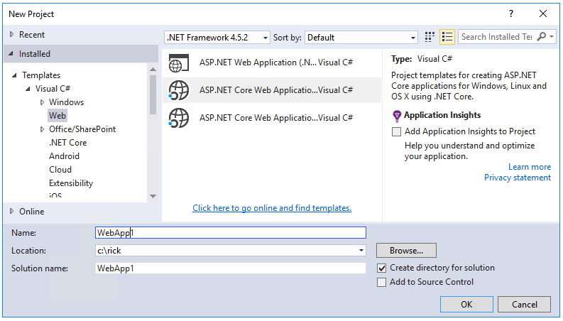
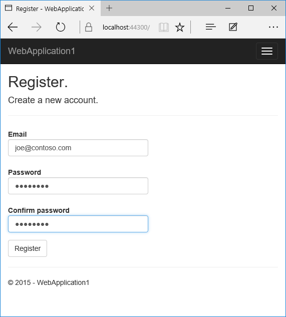
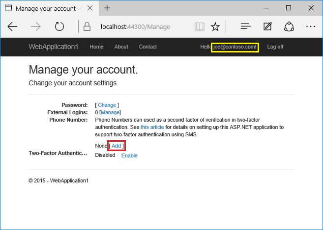
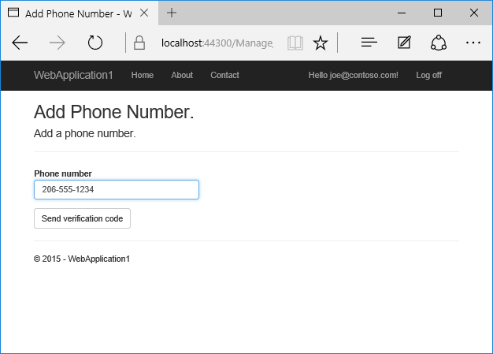
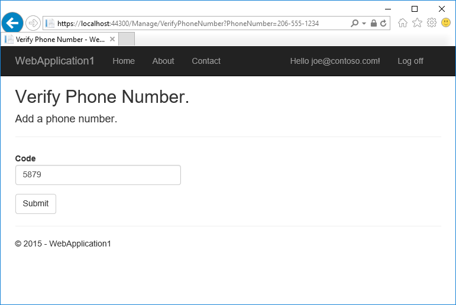
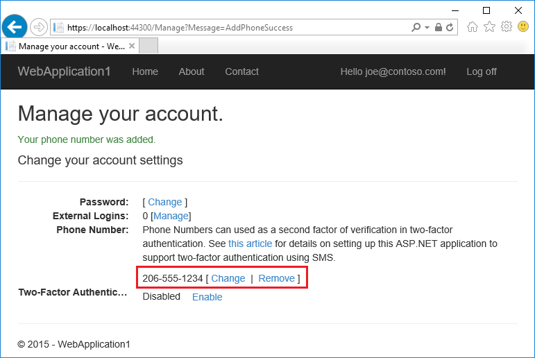
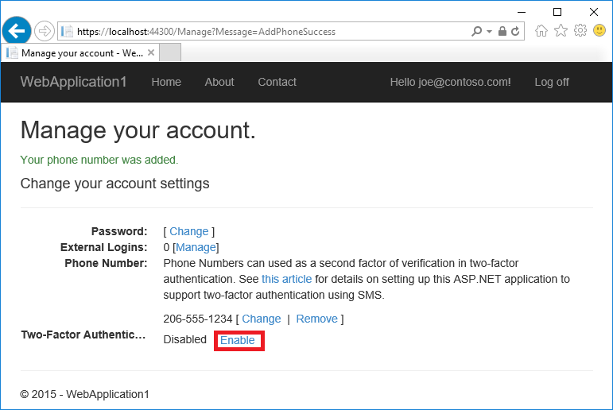
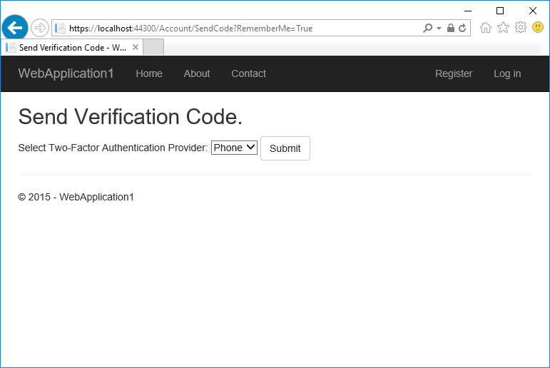
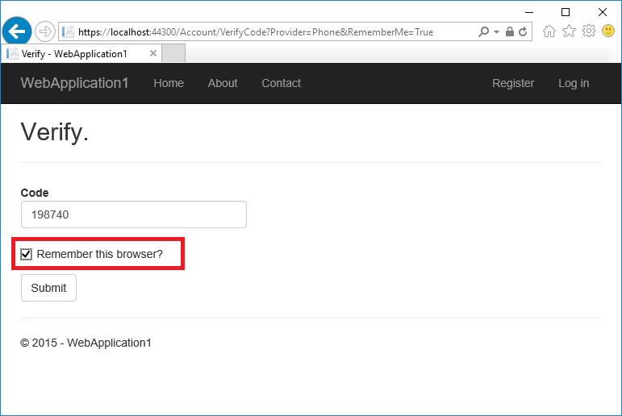

>[!WARNING]
> This page documents version 1.0.0-beta8 and has not yet been updated for version 1.0.0

<a name=security-authentication-2fa></a>

# Two-factor authentication with SMS

By [Rick Anderson](https://twitter.com/RickAndMSFT)

This tutorial will show you how to set up two-factor authentication (2FA) using SMS. Twilio is used, but you can use any other SMS provider. We recommend you complete [Account Confirmation and Password Recovery](accconfirm.md) before starting this tutorial.

## Create a new ASP.NET Core project

Create a new ASP.NET Core web app with individual user accounts.



After you create the project, follow the instructions in [Account Confirmation and Password Recovery](accconfirm.md) to set up and require SSL.

## Setup up SMS for two-factor authentication with Twilio

* Create a [Twilio](http://www.twilio.com/) account.

* On the **Dashboard** tab of your Twilio account, note the **Account SID** and **Authentication token**. Note: Tap **Show API Credentials** to see the Authentication token.

* On the **Numbers** tab, note the Twilio phone number.

* Install the Twilio NuGet package. From the Package Manager Console (PMC),  enter the following the following command:

  <!-- literal_block {"ids": [], "xml:space": "preserve"} -->

  ````

     Install-Package Twilio
     ````

* Add code in the *Services/MessageServices.cs* file to enable SMS.

<!-- literal_block {"xml:space": "preserve", "source": "security/authentication/2fa/sample/WebSMS/src/WebSMS/Services/MessageServices.cs", "ids": [], "linenos": false, "language": "csharp", "highlight_args": {"linenostart": 1}} -->

````c#

   public class AuthMessageSender : IEmailSender, ISmsSender
   {
       public AuthMessageSender(IOptions<AuthMessageSMSSenderOptions> optionsAccessor)
       {
           Options = optionsAccessor.Value;
       }

       public AuthMessageSMSSenderOptions Options { get; }  // set only via Secret Manager

       public Task SendEmailAsync(string email, string subject, string message)
       {
           // Plug in your email service here to send an email.
           return Task.FromResult(0);
       }

       public Task SendSmsAsync(string number, string message)
       {
           var twilio = new Twilio.TwilioRestClient(
               Options.SID,           // Account Sid from dashboard
               Options.AuthToken);    // Auth Token

           var result = twilio.SendMessage(Options.SendNumber, number, message);
           // Use the debug output for testing without receiving a SMS message.
           // Remove the Debug.WriteLine(message) line after debugging.
           // System.Diagnostics.Debug.WriteLine(message);
           return Task.FromResult(0);
       }
   }

   ````

> [!NOTE]
> Twilio does not yet support [.NET Core](https://microsoft.com/net/core). To use Twilio from your application you need to either target the full .NET Framework or you can call the Twilio REST API to send SMS messages.

> [!NOTE]
> You can remove `//` line comment characters from the `System.Diagnostics.Debug.WriteLine(message);` line to test the application when you can't get SMS messages. A better approach to logging is to use the built in [logging](../../fundamentals/logging.md#fundamentals-logging.md).

### Configure the SMS provider key/value

We'll use the [Options pattern](../../fundamentals/configuration.md#options-config-objects.md) to access the user account and key settings. For more information, see [configuration](../../fundamentals/configuration.md#fundamentals-configuration.md).

   * Create a class to fetch the secure SMS key. For this sample, the `AuthMessageSMSSenderOptions` class is created in the *Services/AuthMessageSMSSenderOptions.cs* file.

<!-- literal_block {"xml:space": "preserve", "source": "security/authentication/2fa/sample/WebSMS/src/WebSMS/Services/AuthMessageSMSSenderOptions.cs", "ids": [], "linenos": false, "language": "csharp", "highlight_args": {"linenostart": 1}} -->

````c#

   public class AuthMessageSMSSenderOptions
   {
       public string SID { get; set; }
       public string AuthToken { get; set; }
       public string SendNumber { get; set; }
   }

   ````

Set `SID`, `AuthToken`, and `SendNumber` with the [secret-manager tool](../app-secrets.md). For example:

````none

   C:/WebSMS/src/WebApplication1>dotnet user-secrets set SID abcdefghi
   info: Successfully saved SID = abcdefghi to the secret store.
   ````

### Configure startup to use `AuthMessageSMSSenderOptions`

Add `AuthMessageSMSSenderOptions` to the service container at the end of the `ConfigureServices` method in the *Startup.cs* file:

[!code-c#[Main](../security/authentication/2fa/sample/WebSMS/src/WebSMS/Startup.cs?highlight=4)]

````c#

       // Register application services.
       services.AddTransient<IEmailSender, AuthMessageSender>();
       services.AddTransient<ISmsSender, AuthMessageSender>();
       services.Configure<AuthMessageSMSSenderOptions>(Configuration);
   }

   ````

## Enable two-factor authentication

* Open the *Views/Manage/Index.cshtml* Razor view file.

* Uncomment the phone number markup which starts at

  `@*@(Model.PhoneNumber ?? "None")`

* Uncomment the `Model.TwoFactor` markup which starts at

  `@*@if (Model.TwoFactor)`

* Comment out or remove the `<p>There are no two-factor authentication providers configured.` markup.

   The completed code is shown below:

   <!-- literal_block {"xml:space": "preserve", "source": "security/authentication/2fa/sample/WebSMS/src/WebSMS/Views/Manage/Index.cshtml", "ids": [], "linenos": false, "language": "html", "highlight_args": {"linenostart": 1}} -->

   ````html

      <dt>Phone Number:</dt>
      <dd>
          <p>
              Phone Numbers can used as a second factor of verification in two-factor authentication.
              See <a href="http://go.microsoft.com/fwlink/?LinkID=532713">this article</a>
              for details on setting up this ASP.NET application to support two-factor authentication using SMS.
          </p>
          @(Model.PhoneNumber ?? "None") [
              @if (Model.PhoneNumber != null)
              {
                  <a asp-controller="Manage" asp-action="AddPhoneNumber">Change</a>
                      @: &nbsp;|&nbsp;
                      <a asp-controller="Manage" asp-action="RemovePhoneNumber">Remove</a>
              }
              else
              {
                  <a asp-controller="Manage" asp-action="AddPhoneNumber">Add</a>
              }
              ]
      </dd>

      <dt>Two-Factor Authentication:</dt>
      <dd>
          @*<p>
              There are no two-factor authentication providers configured. See <a href="http://go.microsoft.com/fwlink/?LinkID=532713">this article</a>
              for setting up this application to support two-factor authentication.
          </p>*@
          @if (Model.TwoFactor)
              {
                  <form asp-controller="Manage" asp-action="DisableTwoFactorAuthentication" method="post" class="form-horizontal" role="form">
                      <text>
                          Enabled
                          <button type="submit" class="btn btn-link">Disable</button>
                      </text>
                  </form>
              }
              else
              {
                  <form asp-controller="Manage" asp-action="EnableTwoFactorAuthentication" method="post" class="form-horizontal" role="form">
                      <text>
                          Disabled
                          <button type="submit" class="btn btn-link">Enable</button>
                      </text>
                  </form>
              }
      </dd>

      ````

## Log in with two-factor authentication

* Run the app and register a new user



* Tap on your user name, which activates the `Index` action method in Manage controller. Then tap the phone number **Add** link.



* Add a phone number that will receive the verification code, and tap **Send verification code**.



* You will get a text message with the verification code. Enter it and tap **Submit**



If you don't get a text message, see [Debugging Twilio](#debugging-twilio).

* The Manage view shows your phone number was added successfully.



* Tap **Enable** to enable two-factor authentication.



### Test two-factor authentication

* Log off.

* Log in.

* The user account has enabled two-factor authentication, so you have to provide the second factor of authentication . In this tutorial you have enabled phone verification. The built in templates also allow you to set up email as the second factor. You can set up additional second factors for authentication such as QR codes. Tap **Submit**.



* Enter the code you get in the SMS message.

* Clicking on the **Remember this browser** check box will exempt you from needing to use 2FA to log on when using the same device and browser. Enabling 2FA and clicking on **Remember this browser** will provide you with strong 2FA protection from malicious users trying to access your account, as long as they don't have access to your device. You can do this on any private device you regularly use. By setting  **Remember this browser**, you get the added security of 2FA from devices you don't regularly use, and you get the convenience on not having to go through 2FA on your own devices.



## Account lockout for protecting against brute force attacks

We recommend you use account lockout with 2FA. Once a user logs in (through a local account or social account), each failed attempt at 2FA is stored, and if the maximum attempts (default is 5) is reached, the user is locked out for five minutes (you can set the lock out time with `DefaultAccountLockoutTimeSpan`). The following configures Account to be locked out for 10 minutes after 10 failed attempts.

[!code-c#[Main](../security/authentication/2fa/sample/WebSMS/src/WebSMS/Startup.cs?highlight=1,2,3,4,5)]

````c#

       services.Configure<IdentityOptions>(options =>
       {
           options.Lockout.DefaultLockoutTimeSpan = TimeSpan.FromMinutes(10);
           options.Lockout.MaxFailedAccessAttempts = 10;
       });

       // Register application services.
       services.AddTransient<IEmailSender, AuthMessageSender>();
       services.AddTransient<ISmsSender, AuthMessageSender>();
       services.Configure<AuthMessageSMSSenderOptions>(Configuration);
   }

   ````

## Debugging  Twilio

If you're able to use the Twilio API, but you don't get an SMS message, try the following:

1. Log in to the Twilio site and navigate to the **Logs** > **SMS & MMS Logs** page. You can verify that messages were sent and delivered.

2. Use the following code in a console application to test Twilio:

````c#

   static void Main(string[] args)
   {
     string AccountSid = "";
     string AuthToken = "";
     var twilio = new Twilio.TwilioRestClient(AccountSid, AuthToken);
     string FromPhone = "";
     string toPhone = "";
     var message = twilio.SendMessage(FromPhone, toPhone, "Twilio Test");
     Console.WriteLine(message.Sid);
   }
   ````
