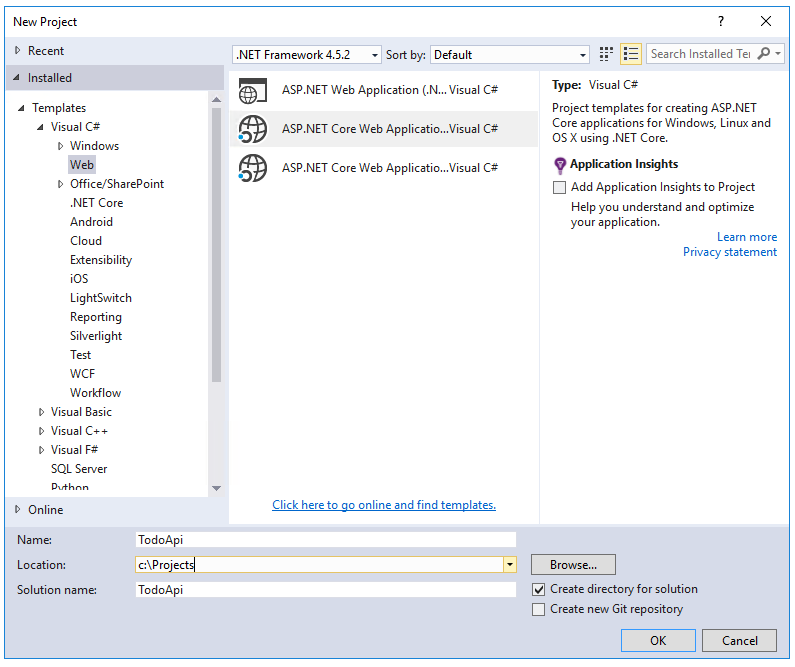
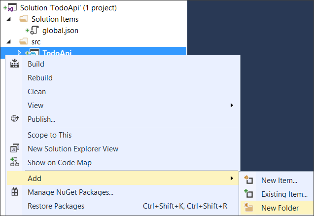
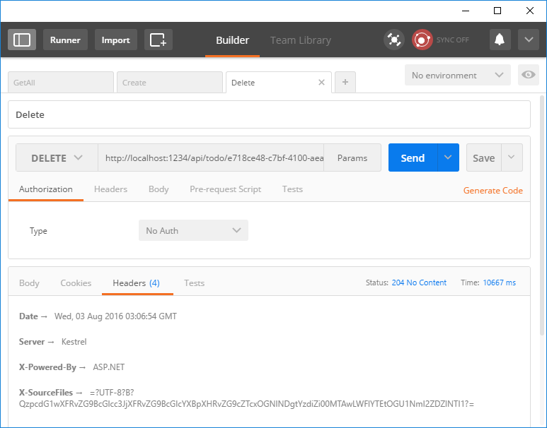

---
uid: tutorials/first-web-api
---
# Building Your First Web API with ASP.NET Core MVC and Visual Studio

By [Mike Wasson](https://github.com/mikewasson) and [Rick Anderson](https://twitter.com/RickAndMSFT)

HTTP is not just for serving up web pages. It’s also a powerful platform for building APIs that expose services and data. HTTP is simple, flexible, and ubiquitous. Almost any platform that you can think of has an HTTP library, so HTTP services can reach a broad range of clients, including browsers, mobile devices, and traditional desktop apps.

In this tutorial, you’ll build a simple web API for managing a list of "to-do" items. You won’t build any UI in this tutorial.

ASP.NET Core has built-in support for MVC building Web APIs. Unifying the two frameworks makes it simpler to build apps that include both UI (HTML) and APIs, because now they share the same code base and pipeline.

> [!NOTE]
> If you are porting an existing Web API app to ASP.NET Core, see [Migrating from ASP.NET Web API](../migration/webapi.md)

## Overview

Here is the API that you’ll create:  

<!-- QAfix fix table -->

API | Description    | Request body    | Response body   
--- | ---- | ---- | ---- 
GET /api/todo  | Get all to-do items | None | Array of to-do items
GET /api/todo/{id}  | Get an item by ID | None | To-do item
POST /api/todo | Add a new item | To-do item  | To-do item 
PUT /api/todo/{id} | Update an existing item &nbsp;  | To-do item 
DELETE /api/todo/{id}  &nbsp;  &nbsp; | Delete an item &nbsp;  &nbsp;  | None. No request body-  | None
     
<br>     
    
The following diagram show the basic design of the app.


* The client is whatever consumes the web API (browser, mobile app, and so forth). We aren’t writing a client in this tutorial. We'll use [Postman](https://www.getpostman.com/) to test the app.

* A *model* is an object that represents the data in your application. In this case, the only model is a to-do item. Models are represented as simple C# classes (POCOs).

* A *controller* is an object that handles HTTP requests and creates the HTTP response. This app will have a single controller.

* To keep the tutorial simple, the app doesn’t use a database. Instead, it just keeps to-do items in memory. But we’ll still include a (trivial) data access layer, to illustrate the separation between the web API and the data layer. For a tutorial that uses a database, see [Building your first ASP.NET Core MVC app with Visual Studio](first-mvc-app/index.md).

## Create the project

Start Visual Studio. From the **File** menu, select **New** > **Project**.

Select the **ASP.NET Core Web Application (.NET Core)** project template. Name the project `TodoApi`, clear **Host in the cloud**, and tap **OK**.



In the **New ASP.NET Core Web Application (.NET Core) - TodoApi** dialog, select the **Web API** template. Tap **OK**.


## Add a model class

A model is an object that represents the data in your application. In this case, the only model is a to-do item.

Add a folder named "Models". In Solution Explorer, right-click the project. Select **Add** > **New Folder**. Name the folder *Models*.



> [!NOTE]
> You can put model classes anywhere in your project, but the *Models* folder is used by convention.

Add a `TodoItem` class. Right-click the *Models* folder and select **Add** > **Class**. Name the class `TodoItem` and tap **Add**.

Replace the generated code with:

[!code-csharp[Main](first-web-api/sample/src/TodoApi/Models/TodoItem.cs)]

## Add a repository class

A *repository* is an object that encapsulates the data layer, and contains logic for retrieving data and mapping it to an entity model. Even though the example app doesn’t use a database, it’s useful to see how you can inject a repository into your controllers. Create the repository code in the *Models* folder.

Start by defining a repository interface named `ITodoRepository`. Use the class template (**Add New Item**  > **Class**).

[!code-csharp[Main](first-web-api/sample/src/TodoApi/Models/ITodoRepository.cs)]

This interface defines basic CRUD operations.

Next, add a `TodoRepository` class that implements `ITodoRepository`:

[!code-csharp[Main](first-web-api/sample/src/TodoApi/Models/TodoRepository.cs)]

Build the app to verify you don't have any compiler errors.

## Register the repository

By defining a repository interface, we can decouple the repository class from the MVC controller that uses it. Instead of instantiating a `TodoRepository` inside the controller we will inject an `ITodoRepository` using the built-in support in ASP.NET Core for [dependency injection](../fundamentals/dependency-injection.md).

This approach makes it easier to unit test your controllers. Unit tests should inject a mock or stub version of `ITodoRepository`. That way, the test narrowly targets the controller logic and not the data access layer.

In order to inject the repository into the controller, we need to register it with the DI container. Open the *Startup.cs* file. Add the following using directive:

````c#

   using TodoApi.Models;
   ````

In the `ConfigureServices` method, add the highlighted code:

[!code-csharp[Main](first-web-api/sample/src/TodoApi/Startup.cs?name=snippet_AddSingleton&highlight=6)]

## Add a controller

In Solution Explorer, right-click the *Controllers* folder. Select **Add** > **New Item**. In the **Add New Item** dialog, select the **Web  API Controller Class** template. Name the class `TodoController`.

Replace the generated code with the following:

[!code-csharp[Main](first-web-api/sample/src/TodoApi/Controllers/TodoController1.cs?name=snippet_todo1)]


This defines an empty controller class. In the next sections, we'll add methods to implement the API.

## Getting to-do items

To get to-do items, add the following methods to the `TodoController` class.

[!code-csharp[Main](first-web-api/sample/src/TodoApi/Controllers/TodoController.cs?name=snippet_GetAll)]

These methods implement the two GET methods:

* `GET /api/todo`

* `GET /api/todo/{id}`

Here is an example HTTP response for the `GetAll` method:

````

   HTTP/1.1 200 OK
   Content-Type: application/json; charset=utf-8
   Server: Microsoft-IIS/10.0
   Date: Thu, 18 Jun 2015 20:51:10 GMT
   Content-Length: 82

   [{"Key":"4f67d7c5-a2a9-4aae-b030-16003dd829ae","Name":"Item1","IsComplete":false}]
   ````

Later in the tutorial I'll show how you can view the HTTP response using [Postman](https://www.getpostman.com/).

### Routing and URL paths

The `[HttpGet]` attribute ([HttpGetAttribute](http://docs.asp.net/projects/api/en/latest/autoapi/Microsoft/AspNetCore/Mvc/HttpGetAttribute/index.html.md#Microsoft.AspNetCore.Mvc.HttpGetAttribute.md)) specifies an HTTP GET method. The URL path for each method is constructed as follows:

* Take the template string in the controller’s route attribute,  `[Route("api/[controller]")]`

* Replace "[Controller]" with the name of the controller, which is the controller class name minus the "Controller" suffix. For this sample, the controller class name is **Todo**Controller and the root name is "todo". ASP.NET Core [routing](../mvc/controllers/routing.md) is not case sensitive.

* If the `[HttpGet]` attribute has a template string, append that to the path. This sample doesn't use a template string.

In the `GetById` method:

````c#

   [HttpGet("{id}", Name = "GetTodo")]
   public IActionResult GetById(string id)
   ````

`"{id}"` is a placeholder variable for the ID of the `todo` item. When `GetById` is invoked, it assigns the value of "{id}" in the URL to the method's `id` parameter.

`Name = "GetTodo"` creates a named route and allows you to link to this route in an HTTP Response. I'll explain it with an example later. See [Routing to Controller Actions](../mvc/controllers/routing.md) for detailed information.

### Return values

The `GetAll` method returns an `IEnumerable`. MVC automatically serializes the object to [JSON](http://www.json.org/) and writes the JSON into the body of the response message. The response code for this method is 200, assuming there are no unhandled exceptions. (Unhandled exceptions are translated into 5xx errors.)

In contrast, the `GetById` method returns the more general `IActionResult` type, which represents a wide range of return types. `GetById` has two different return types:

* If no item matches the requested ID, the method returns a 404 error.  This is done by returning `NotFound`.

* Otherwise, the method returns 200 with a JSON response body. This is done by returning an [ObjectResult](http://docs.asp.net/projects/api/en/latest/autoapi/Microsoft/AspNetCore/Mvc/ObjectResult/index.html.md#Microsoft.AspNetCore.Mvc.ObjectResult.md)

  
### Launch the app

In Visual Studio, press CTRL+F5 to launch the app. Visual Studio launches a browser and navigates to `http://localhost:port/api/values`, where *port* is a randomly chosen port number. If you're using Chrome, Edge or Firefox, the data will be displayed. If you're using IE, IE will prompt to you open or save the *values.json* file.

## Implement the other CRUD operations

We'll add `Create`, `Update`, and `Delete` methods to the controller. These are variations on a theme, so I'll just show the code and highlight the main differences. Build the project after adding or changing code.

### Create

[!code-csharp[Main](first-web-api/sample/src/TodoApi/Controllers/TodoController.cs?name=snippet_Create)]

This is an HTTP POST method, indicated by the [[HttpPost]](https://docs.asp.net/projects/api/en/latest/autoapi/Microsoft/AspNetCore/Mvc/HttpPostAttribute/index.html) attribute. The [[FromBody]](https://docs.asp.net/projects/api/en/latest/autoapi/Microsoft/AspNetCore/Mvc/FromBodyAttribute/index.html) attribute tells MVC to get the value of the to-do item from the body of the HTTP request.

The [CreatedAtRoute](https://docs.asp.net/projects/api/en/latest/autoapi/Microsoft/AspNetCore/Mvc/Controller/index.html) method returns a 201 response, which is the standard response for an HTTP POST method that creates a new resource on the server. `CreateAtRoute` also adds a Location header to the response. The Location header specifies the URI of the newly created to-do item. See [10.2.2 201 Created](http://www.w3.org/Protocols/rfc2616/rfc2616-sec10.html).

### Use Postman to send a Create request


* Set the HTTP method to `POST`

* Tap the **Body** radio button

* Tap the **raw** radio button

* Set the type to JSON

* In the key-value editor, enter a Todo item such as `{"Name":"<your to-do item>"}`

* Tap **Send**

Tap the Headers tab and copy the **Location** header:


You can use the Location header URI to access the resource you just created. Recall the `GetById` method created the `"GetTodo"` named route:

````c#

   [HttpGet("{id}", Name = "GetTodo")]
   public IActionResult GetById(string id)
   ````

### Update

[!code-csharp[Main](first-web-api/sample/src/TodoApi/Controllers/TodoController.cs?name=snippet_Update)]

`Update` is similar to `Create`, but uses HTTP PUT. The response is [204 (No Content)](http://www.w3.org/Protocols/rfc2616/rfc2616-sec9.html). According to the HTTP spec, a PUT request requires the client to send the entire updated entity, not just the deltas. To support partial updates, use HTTP PATCH.


  
### Delete

[!code-csharp[Main](first-web-api/sample/src/TodoApi/Controllers/TodoController.cs?name=snippet_Delete)]

The response is [204 (No Content)](http://www.w3.org/Protocols/rfc2616/rfc2616-sec9.html).



## Next steps

* To learn about creating a backend for a native mobile app, see [Creating Backend Services for Native Mobile Applications](../mobile/native-mobile-backend.md).

* [Routing to Controller Actions](../mvc/controllers/routing.md)

* For information about deploying your API, see [Publishing and Deployment](../publishing/index.md).

* [View or download sample code](https://github.com/aspnet/Docs/tree/master/aspnet/tutorials/first-web-api/sample)

* [Postman](https://www.getpostman.com/)

* [Fiddler](http://www.fiddler2.com/fiddler2/)
